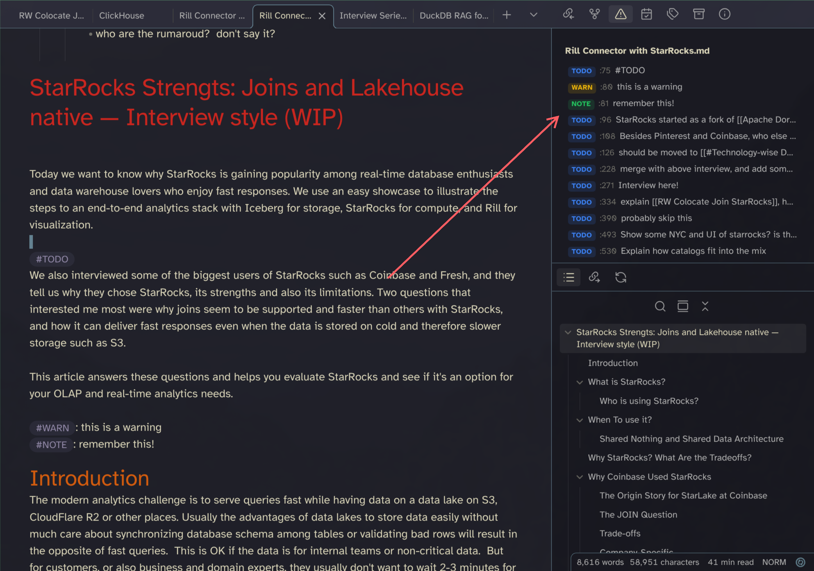

# Trouble Tags

An Obsidian plugin that scans the active file for inline tags (`#TODO`, `#FIXME`, `#BUG`, `#NOTE`, `#WARN`) and lists them in a sidebar panel. Click any entry to jump to that line.

Inspired by [trouble.nvim](https://github.com/folke/trouble.nvim).

## Usage

- **Toggle panel:** Click the ribbon icon or run "Toggle Trouble Tags panel" from the command palette.
- **Click a row** to jump to the corresponding line in the editor.
- The panel rescans automatically when you edit or switch files.

## Install

Copy or symlink this folder into `.obsidian/plugins/obsidian-trouble-tags/`, then enable it in Settings → Community plugins.

### Activate
Via comand palete, search for Trouble.

*Also check out my other Plugin: [Obsidian Open Specific File](https://github.com/sspaeti/obsidian-open-specific-notes)*
